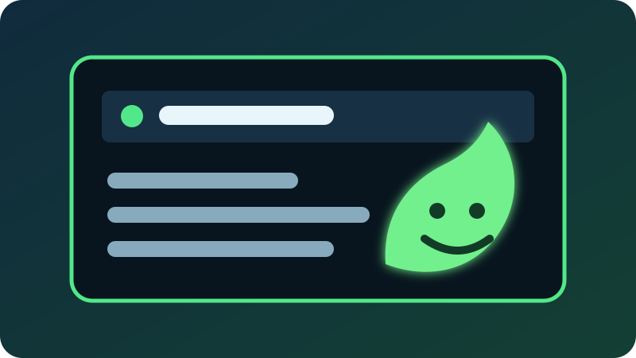
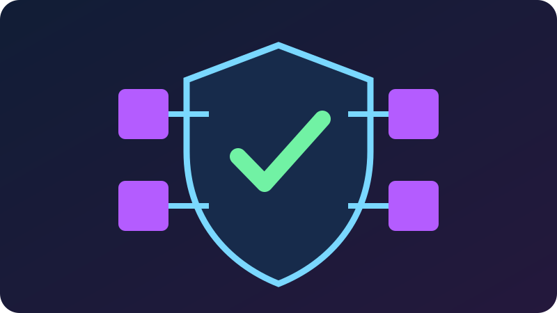
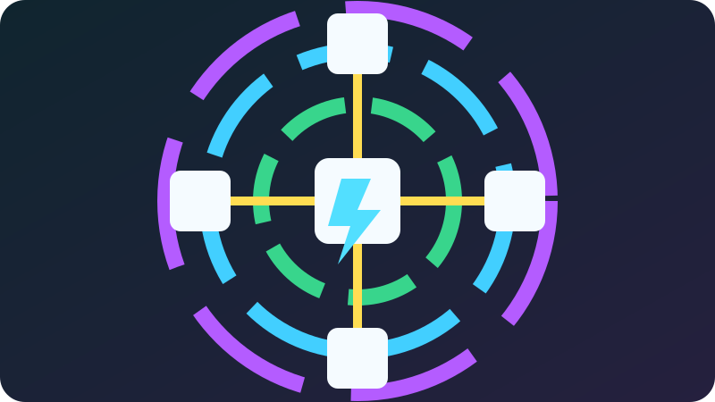

<div align="center">


# Slimefun Legacy

### A modern, English-first continuation of the classic Slimefun experience

Turn a Paper server into a modpack-like world of machines, electricity, automation, cargo networks, magic, reactors, backpacks, and hundreds of custom items—without requiring players to install a client mod.

[](https://github.com/wickidcow/Slimefun-Legacy/actions/workflows/build-ci.yml)
[](https://github.com/wickidcow/Slimefun-Legacy/actions/workflows/stability-release.yml)
[](LICENSE)
[](https://adoptium.net/)
[](https://papermc.io/)
[](#english-first-experience)

[Download](https://github.com/wickidcow/Slimefun-Legacy/releases) ·
[Builds](https://github.com/wickidcow/Slimefun-Legacy/actions) ·
[Report a Bug](https://github.com/wickidcow/Slimefun-Legacy/issues) ·
[Release Notes](STABILITY_RELEASE.md) ·
[Contributing](CONTRIBUTING.md)

</div>

> [!IMPORTANT]
> **Slimefun Legacy is an unofficial downstream maintenance fork.**  
> It is not operated by the original Slimefun team, Slimefun United, the Gugu project, Mojang Studios, or Microsoft.

---

## What is Slimefun Legacy?

Slimefun Legacy preserves the familiar Slimefun gameplay and addon API while focusing on the needs of modern Paper servers:

- A consistent English player experience
- Compatibility with established Slimefun addons and saved worlds
- Safer storage and item recovery tools
- Better protection against machine, backpack, and Cargo failures
- Modern scheduler and Paper compatibility work
- Reviewed upstream synchronization instead of automatic replacement

Players can explore technology and magic at their own pace, build automated factories, transport items through Cargo networks, generate and store electricity, operate reactors, craft powerful equipment, and expand the experience with compatible addons.

<table>
<tr>
<td width="33%" align="center">

<br><strong>English First</strong>
<br>Player-facing names, lore, menus, controls, messages, and logs are maintained in English.
</td>
<td width="33%" align="center">

<br><strong>Stability Focused</strong>
<br>Storage recovery, clean-shutdown tracking, circuit breakers, lifecycle safeguards, and regression tests.
</td>
<td width="33%" align="center">

<br><strong>Legacy Compatible</strong>
<br>Classic addon entry points remain available while modern APIs are added alongside them.
</td>
</tr>
</table>

---

## Highlights

### English-first experience

Slimefun Translate is **not required** for the normal English player experience.

This fork:

- Defaults to `language: en`
- Defaults to `enable-translations: false`
- Replaces hard-coded Chinese player-facing text with English
- Ignores stale per-player Chinese language preferences while translations are disabled
- Disables the in-plugin auto-updater so another upstream JAR cannot silently replace this build
- Includes automated verification to prevent untranslated player-facing text from entering releases

Optional language resources remain in the source tree for upstream compatibility, but they are not used while translations are disabled.

### Storage and Item Doctor

Slimefun Legacy includes an administrator recovery system for repairing the visible names and lore of recognized Slimefun items while preserving their important stored data.

| Command | Purpose |
| --- | --- |
| `/sf doctor status` | Shows shutdown state, pending database writes, paused machine circuits, repairs, and scan status |
| `/sf doctor hand` | Repairs the Slimefun item held by the executing player |
| `/sf doctor inventory [player]` | Repairs an online player's inventory and ender chest |
| `/sf doctor scan` | Performs a batched server-wide dry run without changing items |
| `/sf doctor repair confirm` | Performs the confirmed batched server-wide repair |

Permission: `slimefun.command.doctor`  
Default access: server operators

The doctor identifies items through their persistent Slimefun ID rather than guessing from translated text. Unknown IDs, malformed state, and ambiguous dynamic lore are reported and skipped.

### Stability safeguards

Current maintenance work includes:

- Duplicate and re-entrant backpack-open protection
- Disconnect and failed-open cleanup
- Clean-shutdown markers and pending-write visibility
- Per-machine ticker circuit breakers with cooldown and retry support
- Safer viewer, ticker, chunk, and inventory lifecycles
- Addon compatibility CI against the built Slimefun JAR
- Public API binary compatibility reporting
- Protection integration tests that fail closed
- Thread-safe Paper event and scheduler handling

### Cargo and automation improvements

Cargo maintenance includes:

- Reduced temporary allocation while processing large networks
- Cached attached-block resolution
- Reused item wrappers where safe
- Main-thread topology construction
- Preserved filters, events, round-robin behavior, and overflow handling
- Corrected Cargo profiler accounting
- Clear connector text using `Connected: ✔` and `Connected: ✘`

### Modern scheduler and API work

The maintained codebase includes:

- Tracked global, asynchronous, location-owned, and entity-owned scheduling
- Centralized task cancellation during shutdown
- Folia-capable routing for known region- and entity-owned work
- Storage-neutral `BlockTicker` overloads
- Long-capacity energy APIs using resolved data containers
- `@SlimefunAPI` and `@SlimefunInternal` annotations
- Preserved legacy method descriptors for addon compatibility


## Requirements

### Server

- A supported modern Paper server or compatible fork
- Java 21 or newer
- A full server restart after installation or upgrade

The repository build uses a Java 25 toolchain while emitting Java 21-compatible bytecode.

### Players

Players use a normal Minecraft Java client. No client-side mod is required for core Slimefun gameplay. 
I personally use ItemsAdder by LoneDev to force an unofficial slimefun resource pack

Some servers may optionally provide a resource pack for custom item textures. That resource pack is separate from Slimefun Legacy.

---

## Installation

1. Stop the server normally.
2. Back up the entire server, including:
   - Worlds
   - Player data
   - `plugins/Slimefun/`
   - Slimefun databases
   - Addon configuration and data
3. Download a release from this repository's [Releases](https://github.com/wickidcow/Slimefun-Legacy/releases) page.
4. Place the Slimefun Legacy JAR in the server's `plugins` directory.
5. Remove or archive the previous Slimefun core JAR so only one Slimefun provider loads.
6. Start the server and review the console carefully.
7. Run:

```text
/sf doctor status
```

8. Test representative machines, backpacks, Cargo networks, recipes, protections, and addon items before reopening a production server.

> [!WARNING]
> Never install a new Slimefun core build without a current backup. Do not use `/reload` during item repairs, database work, or migration testing.

---

## Upgrading an existing English or translated installation

Confirm these values in `plugins/Slimefun/config.yml`:

```yaml
options:
  auto-update: false
  language: en
  enable-translations: false
```

Perform a **full restart** after changing these options.

### Existing translated items

Minecraft stores an item's display name and lore inside the item stack. Items created by an older translated build can keep their old visible text after the core plugin is replaced.

Use this sequence:

```text
/sf doctor status
/sf doctor scan
/sf doctor repair confirm
```

Always review the dry-run output before confirming a repair.

The doctor is intentionally conservative. It preserves recognized persistent data and skips cases it cannot identify safely.

---

## Recommended rollout

For a production server:

1. Create a staging copy of the server.
2. Back up all worlds, player data, Slimefun data, and addon data.
3. Install the new build on staging.
4. Run `/sf doctor status`.
5. Run `/sf doctor scan`.
6. Review unknown IDs, skipped templates, and failures.
7. Test machines, power networks, Cargo, backpacks, protections, and addons.
8. Confirm repairs only after the dry run looks correct.
9. Wait until pending database writes return to zero.
10. Stop and restart staging normally.
11. Move to production only after the staging test succeeds.

---

## Compatibility

Slimefun Legacy aims to preserve the established Slimefun 4 addon API while adding safer and more modern internal paths.

Compatibility is tested through:

- Compilation of selected addons against the exact built JAR
- Binary API comparison reports
- Legacy scheduler adapters
- Preserved ticker and energy overloads
- Protection compatibility tests
- Storage and lifecycle regression tests

Because the Slimefun addon ecosystem is large, no fork can guarantee every addon and every historical build. Report reproducible compatibility problems with full version information.

When reporting an addon issue, include:

- Paper build and Minecraft version
- Java version
- Slimefun Legacy version and commit
- Addon name and exact build
- Full startup log
- Full exception stack trace
- Reproduction steps
- Whether the issue occurs on a clean staging server

---

## Configuration

Important defaults:

```yaml
options:
  auto-update: false
  language: en
  enable-translations: false

stability:
  machine-circuit-breaker-cooldown-seconds: 300
  item-doctor:
    enabled: true
    repair-player-on-join: true
    repair-opened-inventories: true
    repair-chunks-on-load: true
    repair-picked-up-items: true
    inventories-per-tick: 12
```

Review generated configuration files after each update. Newly added settings may be inserted automatically with maintained defaults.

---

## Building from source

Clone the repository:

```bash
git clone https://github.com/wickidcow/Slimefun-Legacy.git
cd Slimefun-Legacy
```

Linux or macOS:

```bash
chmod +x gradlew
python3 scripts/verify_english.py .
./gradlew spotlessApply --no-daemon
./gradlew spotlessCheck clean build --no-daemon
```

Windows:

```powershell
python scripts/verify_english.py .
.\gradlew.bat spotlessApply --no-daemon
.\gradlew.bat spotlessCheck clean build --no-daemon
```

The shaded plugin JAR is written to:

```text
build/libs/
```

The build toolchain uses Java 25 and targets Java 21 bytecode.

---

## Upstream synchronization

This repository tracks upstream development through a reviewed synchronization workflow.

The automated process:

1. Downloads a clean upstream source tree.
2. Applies the maintained Albion English patch.
3. Runs English verification.
4. Builds and tests the project.
5. Opens or updates a pull request for review.

Upstream changes are **not auto-merged**. This allows changes to items, constructors, localization, storage, or APIs to be inspected before deployment.

See:

- [`GUGU_UPSTREAM_SYNC.md`](GUGU_UPSTREAM_SYNC.md)
- [`ALBION_MERGE_NOTES.md`](ALBION_MERGE_NOTES.md)
- [`BUILD_VALIDATION.md`](BUILD_VALIDATION.md)

---

## Reporting bugs

Use the [GitHub Issue Tracker](https://github.com/wickidcow/Slimefun-Legacy/issues).

Please do not report only “it does not work.” Include enough information to reproduce and diagnose the problem.

Before opening an issue:

- Test the latest available build on a staging server
- Confirm that only one Slimefun core JAR is installed
- Reproduce the problem without `/reload`
- Check whether the issue belongs to an addon rather than the core
- Include complete logs instead of cropped screenshots of one line

Security-sensitive reports should not include private credentials, database passwords, player personal information, or server secrets in a public issue.

---

## Contributing

Pull requests are welcome.

Before submitting:

```bash
python3 scripts/verify_english.py .
./gradlew spotlessApply --no-daemon
./gradlew spotlessCheck clean build --no-daemon
```

Changes should:

- Preserve English player-facing text
- Preserve legacy addon compatibility where practical
- Include tests for behavior changes
- Avoid unsafe global inventory rewrites
- Keep server-thread and region ownership in mind
- Document migration or configuration changes

See [`CONTRIBUTING.md`](CONTRIBUTING.md) for the full development workflow.

---

## Project lineage and attribution

Slimefun Legacy exists because of years of work throughout the Slimefun community.

This repository retains upstream history and attribution and is based on work from projects including:

- [Slimefun 4](https://github.com/Slimefun/Slimefun4)
- [SlimefunGuguProject/Slimefun4](https://github.com/SlimefunGuguProject/Slimefun4)
- [Slimefun United](https://github.com/Slimefun-United/Slimefun-United)
- The many Slimefun contributors, addon developers, server owners, testers, and translators

Slimefun Legacy is maintained independently and should not be presented as an official release from any upstream project.

---

## License

This project is distributed under the [GNU General Public License v3.0](LICENSE).

The repository retains upstream licensing, contributor history, and attribution requirements. Modifications distributed as binaries must continue to follow the GPL and make the corresponding source available as required by the license.

---

<div align="center">

### Keep Slimefun alive. Keep it compatible. Keep it understandable.

Made for modern Paper servers and the community that still loves Slimefun.

[Back to top](#slimefun-legacy)

</div>
